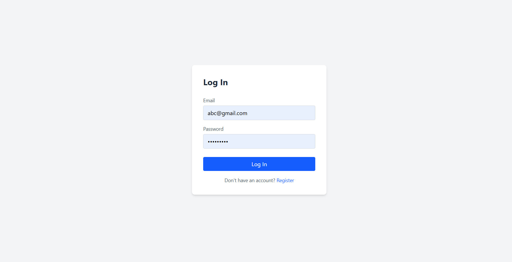
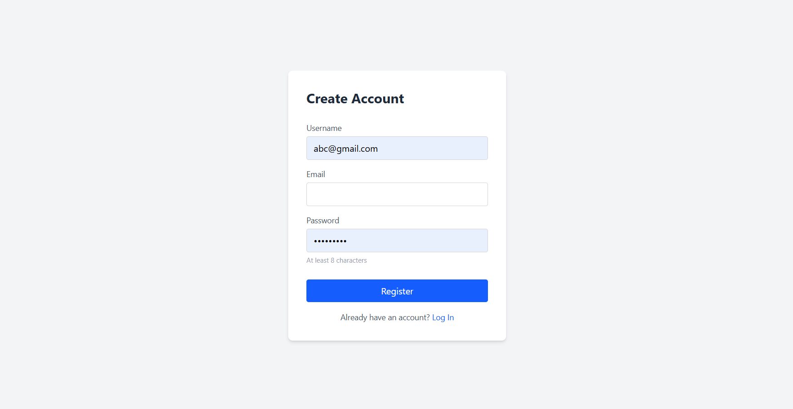
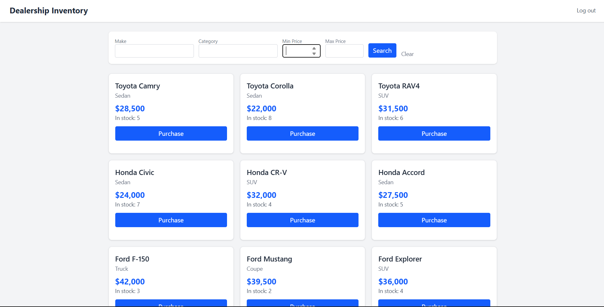
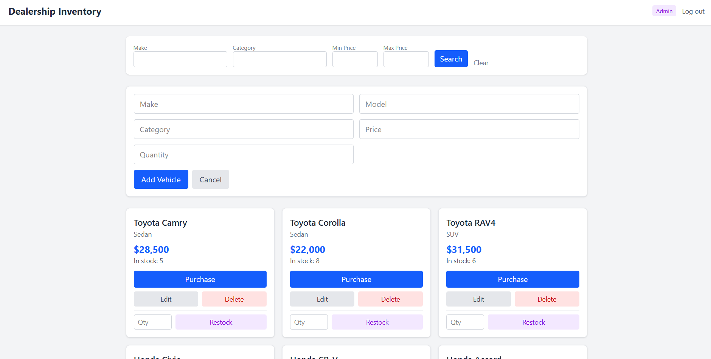
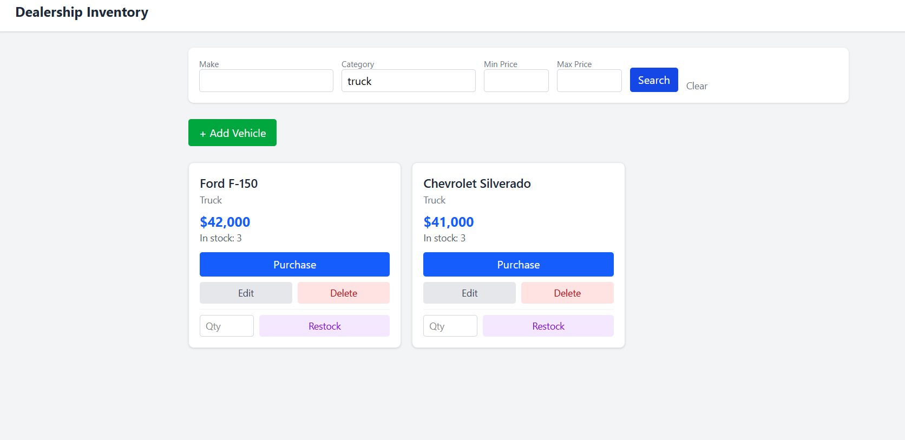

# Car Dealership Inventory System

A full-stack inventory management system for a car dealership, with role-based access control: admins manage inventory (add, update, delete, restock), while customers can browse, search, and purchase vehicles.

## Tech Stack

**Backend:** Python, FastAPI, MongoDB (Atlas), Beanie (ODM), JWT authentication
**Frontend:** React, Vite, TypeScript, Tailwind CSS

## Features

- **Authentication:** JWT-based register/login, with role stored on the user (`admin` or `customer`)
- **Vehicle inventory:** create, read, update, delete, search/filter (by make, category, price range)
- **Purchasing:** any logged-in user can purchase a vehicle, which decrements stock; blocked when out of stock
- **Restocking:** admin-only, increments stock for a given vehicle
- **Role-based access control**, enforced on both the backend (route-level dependency checks against the verified JWT) and the frontend (conditional UI rendering):
  - **Admins** can add, update, delete, and restock vehicles
  - **Customers** can search, browse, and purchase vehicles only

## Setup Instructions

### Prerequisites
- Python 3.12+
- Node.js and npm
- A MongoDB Atlas cluster (free tier is sufficient) or a local MongoDB instance

### Backend

```bash
cd backend
python -m venv venv
venv\Scripts\activate        # Windows
# source venv/bin/activate   # macOS/Linux

pip install -r requirements.txt
```

Create a `.env` file in the `backend/` folder:

```dotenv
MONGODB_URI=mongodb+srv://<user>:<password>@<cluster>.mongodb.net/?appName=Cluster0
DATABASE_NAME=dealership
JWT_SECRET_KEY=<your-secret-key>
```

Run the server:

```bash
uvicorn app.main:app --reload
```

The API will be available at `http://127.0.0.1:8000`. Interactive docs at `http://127.0.0.1:8000/docs`.

### Frontend

```bash
cd frontend
npm install
npm run dev
```

The app will be available at `http://localhost:5173`.

### Promoting a user to admin

New registrations default to the `customer` role. To promote a user to admin, use the included script:

```bash
cd backend
python make_admin.py
```

(Edit the `email` variable in the script to match the account you want to promote.)

### Seeding sample data

To populate the inventory with sample vehicles for testing/demo purposes:

```bash
cd backend
python seed_vehicles.py
```

## Running Tests

```bash
cd backend
pytest --cov=app --cov-report=term-missing
```

## Test Report

```
30 passed in 9.61s

---------- coverage: platform win32, python 3.12.6-final-0 -----------
Name                               Stmts   Miss  Cover   Missing
----------------------------------------------------------------
app\api\auth.py                       12      0   100%
app\api\vehicles.py                   35      0   100%
app\core\config.py                    11      0   100%
app\core\database.py                   8      2    75%   18-19
app\core\deps.py                      23      3    87%   25-26, 33
app\core\security.py                  16      0   100%
app\main.py                           16      3    81%   12-13, 31
app\models\user.py                    13      0   100%
app\models\vehicle.py                 10      0   100%
app\schemas\auth.py                   16      0   100%
app\schemas\vehicle.py                22      0   100%
app\services\auth_service.py          17      0   100%
app\services\vehicle_service.py       55      3    95%   30, 47-48
----------------------------------------------------------------
TOTAL                                480     11    98%
```

All 30 tests pass, covering:
- Authentication (register/login, validation, duplicate email handling)
- Vehicle CRUD, with role enforcement (admin-only create/update/delete)
- Purchase flow (stock decrement, out-of-stock handling, 404s)
- Restock flow (admin-only, validation on negative quantities)
- Search/filtering (by make, category, price range, combined filters, case insensitivity)

The suite was built test-first throughout: each feature has failing tests written before the implementation that makes them pass, with the corresponding red → green commits visible in the git history.

## Screenshots

### Login


### Register


### Dashboard — Customer view


Customers can search, browse, and purchase — no inventory management controls are shown.

### Dashboard — Admin view


Admins see the same browsing experience, plus Add Vehicle, Edit, Delete, and Restock controls.

### Search / filtering


## My AI Usage

I used Claude throughout this assignment as a pair-programming and debugging partner. Specific ways it was used:

- **Debugging environment/connection issues:** diagnosing a PyMongo SSL handshake error down to an Atlas IP whitelist restriction, and a separate bug where the app was silently connecting to a local MongoDB instance instead of Atlas due to a `.env` file path that was resolved relative to the process's working directory rather than the project root.
- **Root-causing a data mismatch:** stepping through config, database connection, and settings files methodically to find why a promoted-to-admin user wasn't showing up correctly, rather than guessing.
- **Implementing and correcting an access-control gap:** the assignment required admin-only add/update/delete for vehicles; initial implementation only restricted delete/restock. Claude helped identify the gap by reviewing the router file against the spec, then updating both the backend route dependencies and the frontend conditional rendering to match.
- **Test-driven fixes:** when restricting vehicle creation to admins, Claude helped identify and fix the cascade of existing tests that depended on customer-created vehicles in their setup, updating them to use admin-authenticated setup while keeping the actual behavior under test unchanged.
- **Writing supporting scripts:** a one-off script to promote a user to admin via direct database update, and a seed script to populate sample inventory data for manual testing.
- **Commit hygiene:** structuring related changes into separate, clearly-described commits (e.g. separating the connection-string bugfix from the access-control fix from its test coverage) rather than one large commit.

